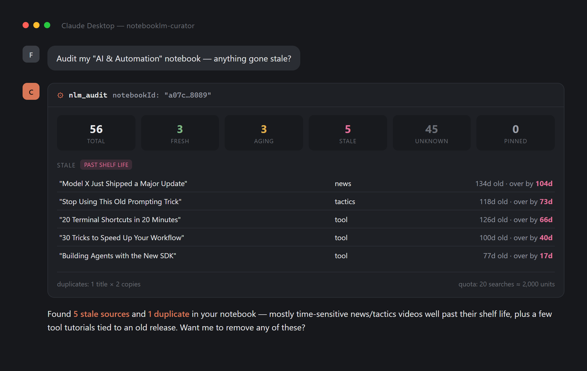

# notebooklm-curator

An MCP server that **watches, audits and safely prunes** Gemini Notebook (formerly NotebookLM) libraries.

> **Not an official Google or Anthropic integration.** This drives NotebookLM
> through your own signed-in Chrome profile — it is not affiliated with,
> endorsed by, or connected to Google in any way. Consider using a separate
> Google account rather than your primary one; the `account` parameter
> supports multiple profiles. See [Known limitations](#known-limitations) for
> the full picture before pointing it at anything you care about.

The curator adds source lifecycle tools on top of the usual add-and-ask workflow:

| Tool | What it does | In other NotebookLM MCPs |
|---|---|---|
| `nlm_list_sources` | Lists the sources in a notebook | ✗ missing |
| `nlm_remove_source` | Deletes a source | ✗ missing |
| `nlm_audit` | Flags stale sources by shelf life | ✗ missing |
| `nlm_watch_source` | Watches a YouTube channel or playlist | ✗ missing |
| `nlm_sync_watches` | Finds and optionally adds new videos | ✗ missing |

Also included: `nlm_auth`, `nlm_list_notebooks`, `nlm_create_notebook`,
`nlm_rename_notebook`, `nlm_add_source`, `nlm_ask`, `nlm_manage_watches`,
`nlm_list_candidates`, and `nlm_approve_candidates`.



*(Titles above are representative examples; the counts reflect a real run against a 56-source notebook.)*

---

## Why browser automation

NotebookLM has **no public API** on the consumer side. Source lists, publish dates,
and deletion are not reachable over HTTP. The Gemini Notebook Enterprise API on
Google Cloud is a separate product that needs an enterprise account.

So the only way in is a persistent Chrome profile. Every selector lives in one
file, `src/notebooklm.js` — when Google ships a UI change, that's the only file
that needs an update.

Selectors were verified live against notebooklm.google.com on 2026-07-29.

---

## Requirements

- **Node.js 20+**
- **Google Chrome installed** (Windows or macOS — the standard desktop app
  from [google.com/chrome](https://www.google.com/chrome/)). This tool
  automates your real Chrome install on purpose, not a downloaded Chromium
  build: patchright's anti-detection patches are far more effective against
  NotebookLM's bot checks when running inside an actual Chrome, so we don't
  trade that away for a "works anywhere" default. If Chrome isn't found,
  `nlm_auth`/any tool call fails immediately with a clear message instead of
  a cryptic browser-launch error. Because real Chrome is used by default,
  `npm install` does **not** download a separate Chromium build — nothing
  extra to fetch, nothing extra on disk. (If you deliberately opt into
  `NLM_BROWSER_CHANNEL=chromium`, run `npx patchright install chromium`
  once yourself first.)
- Tested on Windows and macOS. Linux is not a current target.

## Setup

```bash
git clone https://github.com/furkancakmakcreative/notebooklm-curator.git
cd notebooklm-curator
npm install
```

Copy `.env.example` to `.env` for YouTube date resolution and watched sources:

```
YOUTUBE_API_KEY=your_own_key
```

> The key stays on your machine. The server only sends it to `googleapis.com`
> and never logs or forwards it elsewhere.

### Connecting to Claude Desktop / Claude Code

`%APPDATA%\Claude\claude_desktop_config.json` (Windows) or the equivalent
config on macOS/Linux:

```json
{
  "mcpServers": {
    "notebooklm-curator": {
      "command": "node",
      "args": ["/full/path/to/notebooklm-curator/src/index.js"],
      "env": { "YOUTUBE_API_KEY": "your_own_key" }
    }
  }
}
```

Fully restart your MCP client. On first use, call `nlm_auth`: a visible Chrome
window opens, you sign in with your Google account once, and the session is
saved to a persistent local profile. Every run after that is headless.

---

## Getting a YouTube API key

Google Cloud Console → **APIs & Services**

1. **Library** → search "YouTube Data API v3" → **Enable**
2. **Credentials** → **Create credentials** → **API key**
3. Click the key → **API restrictions** → *Restrict key* → select only
   **YouTube Data API v3** → Save

Don't skip step 3. If a restricted key ever leaks, it can only read public
YouTube data — it can't touch your account or spend money.

### Quota

The current YouTube Data API model counts these list requests at one unit each:

- `videos.list`, `channels.list`, `playlists.list` and `playlistItems.list` → **1 unit** per call
- `search.list` → **1 unit** per call and a separate default allowance of 100 search calls per day

NotebookLM never exposes a source's URL, so an audit may need title searches.
Save the returned `videoId` values and pass them back to `nlm_audit` as
`knownIds`; later audits use batched `videos.list` calls. Channel and playlist
watches avoid title search entirely and use canonical IDs.

The `searchBudget` parameter caps search calls (default 60).

YouTube changed this accounting in June 2026. See the current
[quota table](https://developers.google.com/youtube/v3/determine_quota_cost) and
[`search.list` reference](https://developers.google.com/youtube/v3/docs/search/list).

---

## Watched YouTube sources

`nlm_watch_source` accepts a channel ID, `@handle`, channel URL, playlist ID,
or playlist URL. A new watch baselines the newest current video and does not
pull the existing archive unless `initialItems` is explicitly set (maximum 50).

```json
{
  "source": "@GoogleDevelopers",
  "notebookId": "...",
  "mode": "review",
  "intervalHours": 48,
  "sourceLimit": 50,
  "reserveSlots": 5
}
```

Modes:

- `report`: records and reports new candidates.
- `review`: queues candidates for `nlm_approve_candidates` (default).
- `auto`: adds eligible videos automatically after `minAutoAddAgeHours`
  (default 72 hours), while enforcing the configured source budget. Creating
  or updating a watch to this persistent mode requires `confirmAuto: true`.

Every video is tracked by its canonical YouTube ID. Repeated runs are
idempotent, and watches targeting the same notebook serialize additions so
they cannot race past the source limit. A process crash during an add produces
an `uncertain` candidate; it is never retried or marked as added automatically.
After checking the notebook, explicitly approve it with `uncertainAction` set
to `mark-added` if the source is already present, or `retry-add` if it is absent.

NotebookLM limits vary by plan. At the time of writing they are 50 sources for
Standard, 100 for Plus, 300 for Pro, and 500 or 600 for Ultra. Set
`sourceLimit` to the target account's real limit. `reserveSlots` keeps room for
manual sources. Current limits are listed in
[NotebookLM Help](https://support.google.com/notebooklm/answer/16213268).

### Automatic catch-up and scheduling

When the MCP server starts, it performs a non-blocking catch-up for watches
whose last successful sync is older than their `intervalHours`. If the computer
was off at the scheduled time, the next launch finds everything since the last
stored video instead of losing the missed run.

For Windows Task Scheduler or cron, use the separate one-shot command:

```bash
npm run sync -- --account default
```

Useful options are `--watch-id`, `--force`, and `--max-pages`. The command
prints compact JSON and exits after one run. Configure desktop schedulers to
run missed tasks as soon as the computer becomes available. A powered-off
computer cannot run locally; a future hosted worker would be required for
true off-device execution.

---

## Shelf-life policy

A single global "40 days" threshold gets the wrong answer both ways: a model
announcement is dead in three weeks; a typography video is still useful in
three years. Shelf life is therefore a function of category:

| Category | Days | What lands here |
|---|---|---|
| `news` | 30 | announcements, release notes, weekly roundups |
| `tactics` | 45 | rate limits, model ranking/picking advice tied to a moving target |
| `tool` | 60 | tool usage, workflow tied to a specific release |
| `official` | 150 | Anthropic/Claude official product-feature videos |
| `tutorial` | 120 | courses, walkthroughs, technical deep-dives |
| `principle` | 1095 | theory, strategy, timeless craft |

`nlm_audit` guesses a category from the title heuristically; override any
threshold with the `categories` parameter:

```json
{ "notebookId": "...", "categories": { "news": 14, "tool": 45 } }
```

Status values: `fresh` → `aging` (75% of shelf life burned) → `stale`.
Sources whose date can't be resolved are `unknown` — a date is never guessed.

By default the response only gives you counts for `fresh`/`pinned` sources,
not their full per-item detail — you rarely need to see the sources that
need no action. Pass `includeFresh: true` to get everything, e.g. for a
full-library export.

---

## Delete safety

`nlm_remove_source` is irreversible and refuses to run without `confirm: true`.
`nlm_audit` never deletes anything — it only produces a report.

Intended flow: `nlm_audit` → show the list to the user → call
`nlm_remove_source` one title at a time for what they approve. The model
bulk-deleting on its own is blocked by design.

---

## How `nlm_ask` actually detects "the answer is done"

This turned out to be the hardest part of the tool, worth documenting because
the wrong approach *looks* like it works until it silently doesn't.

The first instinct is to poll `document.querySelector('main').innerText` until
it stops changing. That's wrong: NotebookLM's chat panel renders **outside**
`<main>` entirely. The text there never changes, so the polling loop reports
"stable" almost instantly and returns whatever happens to be sitting in
`<main>` at that moment — in one observed case, hidden emoji-picker markup
that had nothing to do with the question asked.

The actual reliable signal is a `.thinking-message` element (it carries an
`is-changing` class while streaming) detaching from the DOM once the model
finishes. Even then, the query textarea's `disabled` attribute clears
slightly *after* that detachment — firing the next question too early hits a
still-disabled box and hangs. `ask()` in `src/notebooklm.js` waits for both,
in order, before reading the last `.chat-message-pair`'s answer text.

If you're extending this tool and NotebookLM's DOM changes again, that's the
one thing worth re-verifying live before touching anything else. If a wait
times out, `nlm_ask` sets `incomplete: true` on its response rather than
silently returning stale or partial text as if it were final.

`nlm_ask` also enforces a minimum gap (default 4s, `NLM_MIN_ASK_INTERVAL_MS`)
between question submissions. Firing questions back-to-back is a pattern real
usage never produces, and it's the most plausible trigger for NotebookLM
occasionally refusing to answer ("Şu anda yanıt vermekte zorlanıyorum") —
this is cheap insurance against that, not a confirmed root cause.

---

## Known limitations

- **Source URLs are not readable.** NotebookLM never puts them in the DOM —
  no href, no data attribute, clicking a row doesn't reveal one either. Titles
  are used as the identifier instead, so two sources with an identical title
  can't be told apart (`findDuplicates` reports these separately).
- **The delete confirmation dialog** may or may not appear depending on
  rollout; the code handles both and verifies the source count afterward.
  `removeSource` re-checks the target row's title immediately before acting
  on it, but a full guarantee against the list reordering mid-click isn't
  possible with index-based targeting alone.
- **UI text matching is English/Turkish only.** Menu items, buttons, and the
  category-guessing heuristics in `policy.js` match against those two
  languages; a notebook in a third UI language may fail to categorize or to
  find the "remove" menu item.
- **Freshness dates only resolve for YouTube sources today.** Web pages and
  PDFs always come back `unknown` — there's no per-page date extraction yet.
- Fixed `waitForTimeout` calls are used in a few places instead of polling
  for a DOM signal; on a slow connection they can under-wait, on a fast one
  they add latency. `ask()` uses the more robust polling pattern — anything
  ported from `removeSource`/`addSource` should follow that model instead.
- If Google changes the UI, `src/notebooklm.js` is the only file that needs
  updating.
- `renameNotebook` and `addSource` report success once the DOM action is
  triggered, without re-reading the page to confirm it actually applied
  (unlike `removeSource`, which re-verifies). On a slow/flaky page a rename
  or add could silently no-op.
- The Chrome profile directory is created with `mode: 0o700`, which is a
  no-op on Windows NTFS (no ACL is set) — on Windows the directory's
  permissions are whatever the OS default is for your user folder, not
  actually restricted to your account alone.
- **Watched YouTube sources need an API key.** Automatic NotebookLM adds also
  need the saved Chrome session to remain authenticated.
- **Very new or uncaptioned videos may not import.** Automatic mode waits 72
  hours by default because NotebookLM may reject recently uploaded videos.
- **Playlist scans are bounded.** Playlists can be reordered, so they are
  rescanned and deduplicated instead of trusting a cursor. If `maxPages` is too
  low, the sync reports truncation and does not mark the watch successful.
- **Crash recovery needs an explicit decision.** NotebookLM does not expose
  source URLs in the DOM, so a visible title cannot prove identity. An
  `uncertain` candidate therefore stays blocked until the user explicitly
  chooses `mark-added` or `retry-add`.

## Roadmap

Ideas intentionally left out of the focused v0.2 release:

- Hosted discovery that works while the user's computer is powered off.
- YouTube push notifications instead of periodic polling.
- RSS and sitemap watch adapters.
- Optional Apify discovery for sites without a stable API or feed.
- Notifications and cross-notebook source search.

Contributions on any of these are welcome.

## License

MIT
