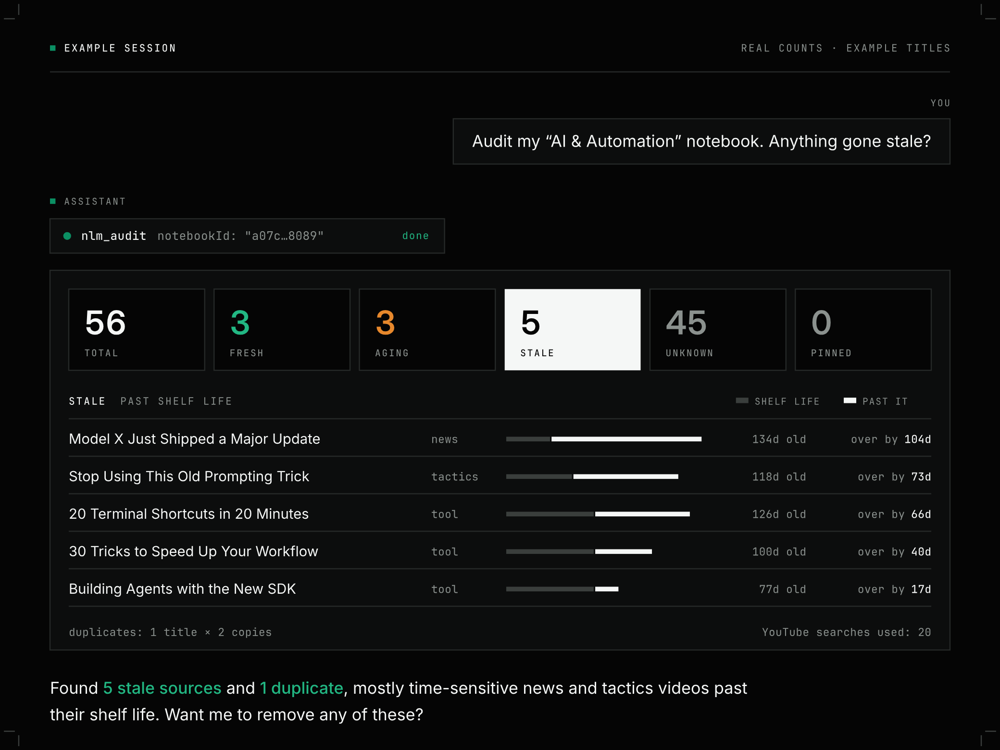

<picture>
  <source media="(prefers-color-scheme: dark) and (max-width: 600px)" srcset="./docs/hero-mobile-dark.svg">
  <source media="(prefers-color-scheme: light) and (max-width: 600px)" srcset="./docs/hero-mobile-light.svg">
  <source media="(prefers-color-scheme: dark)" srcset="./docs/hero-dark.svg">
  <source media="(prefers-color-scheme: light)" srcset="./docs/hero-light.svg">
  
</picture>

**Keeps your NotebookLM library fresh.** Ask Claude to follow a YouTube channel and new
videos land in your notebook. Ask it to audit a notebook and every source is checked
against a shelf life that fits its topic. Nothing is deleted without your approval.

Works in **Claude Desktop** and **Claude Code** on Windows and macOS.
**[Türkçe kurulum rehberi](README.tr.md)**

> NotebookLM was renamed Gemini Notebook in July 2026. Same product, same notebooks;
> this tool works with it under either name.

## Install

You need **Google Chrome** (the normal desktop browser) and a Google account that uses NotebookLM.

### Claude Desktop: one click, no terminal

1. Download **[notebooklm-curator.mcpb](https://github.com/furkancakmakcreative/notebooklm-curator/releases/latest/download/notebooklm-curator.mcpb)**.
2. Double-click the file. Claude Desktop opens an install window; click **Install**.
   If nothing opens, go to **Settings → Extensions** in Claude Desktop and drag the file onto that page.
3. Leave the YouTube API key field empty. It is optional.

### Claude Code: one command

Needs [Node.js](https://nodejs.org) 20 or newer and Git. Paste into a terminal:

```bash
claude mcp add --scope user notebooklm-curator -- npx -y github:furkancakmakcreative/notebooklm-curator
```

On Windows (PowerShell or Command Prompt):

```bash
claude mcp add --scope user notebooklm-curator -- cmd /c npx -y github:furkancakmakcreative/notebooklm-curator
```

The first start downloads the tool and can take half a minute. If Claude Code shows it as failed,
type `/mcp` and reconnect it.

### Then, in either app

Start a new chat and say:

> **Set up NotebookLM Curator.**

Claude checks what is ready and walks you through the rest. The only step that needs you:
a Chrome window opens once, you sign in to Google there, and tell Claude you are done.
After that everything runs in the background.

## What to ask

| You say | What happens |
|---|---|
| "List my notebooks." | Every notebook with its source count. |
| "Audit my *AI Research* notebook. Anything stale?" | Each source gets a category and a shelf life; stale, aging and duplicate sources are listed. Nothing is deleted. |
| "Remove the stale ones you listed." | Claude confirms each title with you, then removes only those. |
| "Follow @GoogleDevelopers for my *AI Research* notebook." | New uploads are collected for your review. Existing videos are not imported. |
| "Any new videos from the channels I follow?" | Checks every followed channel and playlist and lists what is new. |
| "Add the new ones." | Adds the videos you approved, within your notebook's source limit. |
| "Ask my notebook: what are the main arguments?" | Returns NotebookLM's answer. |

<picture>
  <source media="(prefers-color-scheme: dark)" srcset="./docs/demo-dark.svg">
  <source media="(prefers-color-scheme: light)" srcset="./docs/demo-light.svg">
  
</picture>

*Titles are representative examples. The counts come from a real run against a 56-source notebook;
`unknown` means the source's date was not looked up or could not be found.*

## YouTube API key (optional)

Following channels works **without** a key: the tool reads YouTube's public feed, which shows each
channel's newest 15 videos. That is plenty when it checks every day or two; if more than 15 come out
between two checks, it tells you.

A key adds three things: **publish dates in audits** (NotebookLM does not show a video's link, so the
date has to be looked up by title), **full history** for channels, and **playlists longer than 15
videos** (without a key only a playlist's first 15 entries are visible).
It is free and takes about five minutes:

1. Open [Google Cloud Console](https://console.cloud.google.com/) and create a project if asked.
2. **APIs & Services → Library**, search **YouTube Data API v3**, click **Enable**.
3. **APIs & Services → Credentials → Create credentials → API key**.
4. Click the new key, under **API restrictions** choose **Restrict key**, tick only
   **YouTube Data API v3**, and save. A restricted key can only read public YouTube data.
5. Claude Desktop: open the extension's settings under **Settings → Extensions** and paste the key.
   Claude Code: `claude mcp remove notebooklm-curator`, then run the install command again with
   `-e YOUTUBE_API_KEY=your_key` added right after `notebooklm-curator` (before the `--`).

The key stays on your computer and is only sent to `googleapis.com`.

## How it decides what is stale

A single "older than 40 days" rule is wrong both ways: a model announcement is outdated in three
weeks, a video on typography is still useful in three years. So the shelf life depends on the category:

| Category | Days | What lands here |
|---|---|---|
| `news` | 30 | announcements, release notes, weekly roundups |
| `tactics` | 45 | rate limits, "which model to use" advice tied to a moving target |
| `tool` | 60 | tool usage, workflows tied to a specific release |
| `tutorial` | 120 | courses, walkthroughs, technical deep dives |
| `official` | 150 | product feature videos from the Anthropic and Claude channels |
| `principle` | 1095 | theory, strategy, timeless craft |

The category is guessed from the title (English and Turkish keywords). Any number can be changed,
for example: "audit it, but treat news as stale after 14 days".
A source is `aging` once 75% of its shelf life is used, `stale` after that, and `unknown` when its
date can't be found. A date is never guessed.

## Safety

- **Nothing is deleted without approval.** `nlm_remove_source` refuses to run unless the call carries
  `confirm: true`, and Claude is told to ask you about each exact title. The audit is read-only.
- **Following a channel or playlist never imports what is already there** unless you ask for a number
  of recent videos (at most 50). New videos wait for your review by default. A fully automatic mode exists; turning
  it on needs an explicit confirmation.
- **It runs on your computer**, in a separate Chrome profile that only this tool uses. Your password is
  never stored, only that profile's Google session. Consider signing in with a Google account you keep
  for research rather than your main one.
- **Not affiliated with Google or Anthropic.** There is no public NotebookLM API for this, so the tool
  uses the NotebookLM website the way a person would. When Google changes that website, some actions
  can stop working until an update ships.

## Known limitations

- **Windows and macOS only.** Linux is not a target.
- **Source links are not readable.** NotebookLM never shows a source's URL on the page, so titles are
  the identifier. Two sources with the same title are reported as duplicates, and deleting one of them
  needs you to say which.
- **Dates only for YouTube.** Web pages and PDFs always show as `unknown` in audits.
- **Very new or uncaptioned videos may not import.** Automatic mode waits 72 hours by default.
- **Button text matching covers English and Turkish.** A NotebookLM interface in another language may
  fail to find some buttons.
- **The computer has to be on.** Followed channels are checked when the tool starts and whenever you
  ask. Missed checks catch up on the next start; nothing is lost, it arrives later. A scheduled task can
  run checks for you (see *Scheduling* under For developers).

## For developers

<details>
<summary>Manual install, configuration, tools, scheduling, releasing</summary>

### Manual install

```bash
git clone https://github.com/furkancakmakcreative/notebooklm-curator.git
cd notebooklm-curator
npm install
```

Claude Desktop without the extension, in `claude_desktop_config.json`:

```json
{
  "mcpServers": {
    "notebooklm-curator": {
      "command": "node",
      "args": ["/full/path/to/notebooklm-curator/src/index.js"],
      "env": { "YOUTUBE_API_KEY": "" }
    }
  }
}
```

Environment variables (all optional, see `.env.example`): `YOUTUBE_API_KEY`, `NLM_DATA_DIR`
(browser profile and watch state), `NLM_BROWSER_CHANNEL` (`chrome` or `chromium`),
`NLM_MIN_ASK_INTERVAL_MS` (default 4000), `NLM_STARTUP_ACCOUNT`, `NLM_STARTUP_DELAY_MS`.

### Tools

| Tool | What it does |
|---|---|
| `nlm_setup` | Readiness check with plain-language next steps. Opens no window. |
| `nlm_auth` | Opens Chrome for a one-time Google sign-in; the next call confirms it and closes the window. |
| `nlm_list_notebooks`, `nlm_list_sources` | Read notebooks and sources. |
| `nlm_audit` | Shelf-life audit and duplicates, read-only. Options: `includeFresh`, `categories`, `knownIds`, `searchBudget`. |
| `nlm_remove_source` | Delete by exact title. Requires `confirm: true`; `occurrence` picks one of several same-title sources. |
| `nlm_create_notebook`, `nlm_rename_notebook` | Create and rename. Renames are checked again after a reload. |
| `nlm_add_source` | Add a URL. Success is confirmed by the source list growing; `submitted: true` without `added` means check the notebook before retrying. |
| `nlm_ask` | Ask a question. `incomplete: true` when the answer may be partial. |
| `nlm_watch_source`, `nlm_manage_watches` | Follow a channel or playlist; list, pause, resume, update, remove. |
| `nlm_sync_watches`, `nlm_list_candidates`, `nlm_approve_candidates` | Discover, review and add new videos. |

Watch modes: `report` (lists only), `review` (default, waits for `nlm_approve_candidates`), `auto`
(adds after `minAutoAddAgeHours`, needs `confirmAuto: true`). Set `sourceLimit` to your plan's limit
(at the time of writing 50 Standard, 100 Plus, 300 Pro, 500 or 600 Ultra, see
[NotebookLM Help](https://support.google.com/notebooklm/answer/16213268)); `reserveSlots` keeps room
for manual sources. A crash during an add leaves an `uncertain` candidate that is never retried on its
own; resolve it with `uncertainAction: "mark-added"` or `"retry-add"`.

### Scheduling

```bash
cp .env.example .env   # once; it can stay empty
npm run sync -- --account default
```

One run for Windows Task Scheduler or cron (`--watch-id`, `--force`, `--max-pages`). It prints compact
JSON and exits. Configure the scheduler to run missed tasks as soon as the computer is available.

### YouTube quota

With a key, `videos.list`, `channels.list`, `playlists.list` and `playlistItems.list` cost one unit per
call; `search.list` has its own default allowance of 100 calls a day. An audit searches each title once;
pass the returned `videoId`s back as `knownIds` and later audits cost almost nothing. `searchBudget`
caps searches per audit (default 60). See the
[quota table](https://developers.google.com/youtube/v3/determine_quota_cost).

### Releasing

Bump `version` in both `package.json` and `manifest.json`, add a `CHANGELOG.md` entry, then push a
`vX.Y.Z` tag. The release workflow runs the tests, builds `notebooklm-curator.mcpb` and attaches it to a
GitHub Release. `npm run pack:mcpb` builds the same file locally.

How the browser side works, and why: [docs/under-the-hood.md](docs/under-the-hood.md).

</details>

## Roadmap

- Checks that run while your computer is off.
- RSS and sitemap watches for blogs and documentation sites.
- Dates for web and PDF sources.

Ideas and bug reports are welcome in [Issues](https://github.com/furkancakmakcreative/notebooklm-curator/issues).

## License

MIT
